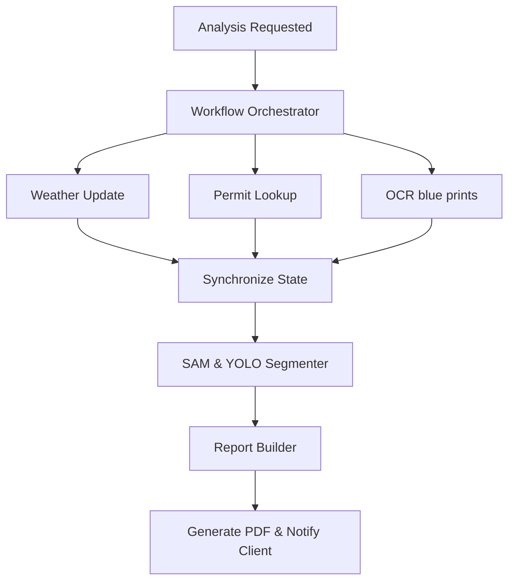

# System Architecture & Workflow Orchestration

RoofIQ AI 2.0 uses a decoupled microservice layout managed by a centralized, state-based **Workflow Orchestrator** pattern.

---

## 1. High-Level Architecture

The platform separates compute-heavy AI inference from real-time API transactions:
- **`backend-core`**: Binds routes, handles authentication, session validation, and initiates analysis jobs.
- **`ai-service`**: Hosts FastAPI wrappers loading computer vision (SAM 2, YOLOv11) and OCR local executors.
- **`measurement-engine`**: Lightweight, standalone library calculating pitch slope trigonometry, 3D plane areas, and gutter runs.
- **`email-service`**: Listens to Redis channels and dispatches transactional emails.

---

## 2. Workflow Orchestrator

Instead of fragile linear job chaining (Service A ➔ Service B ➔ Service C), we introduce a centralized **Workflow Orchestrator** using BullMQ parent-child dependencies:

### Key Orchestrator Features
- **Parallel Task Dispatch**: Weather forecasts, permit lookups, and drawing scans run simultaneously.
- **State Merging**: The orchestrator waits for all prerequisite stages to settle before spawning dependent tasks.
- **Retry Mechanics**: Failed API calls (e.g. NOAA server timeout) are automatically retried with exponential backoff before marking the job stage as failed.
