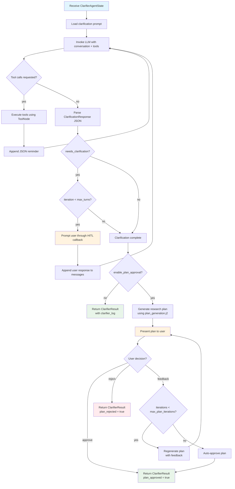

<!--
SPDX-FileCopyrightText: Copyright (c) 2025-2026, NVIDIA CORPORATION & AFFILIATES. All rights reserved.
SPDX-License-Identifier: Apache-2.0
-->

# Clarifier Agent

The Clarifier Agent provides human-in-the-loop (HITL) interaction before deep
research begins. It gathers clarifications from the user, generates a
structured research plan, and optionally presents the plan for approval.

**Location:** `src/aiq_agent/agents/clarifier/agent.py`

## Purpose

Deep research is expensive in both time and compute. The Clarifier reduces
wasted effort by:

1. Asking focused clarification questions to narrow the research scope
2. Generating a structured research plan with title and sections
3. Allowing the user to approve, reject, or provide feedback on the plan

The clarifier runs on the deep research path and also when a shallow query
escalates to deep. It can be disabled entirely using `enable_clarifier: false`
in the orchestrator config.

## Internal Flow



## State Model

### ClarifierAgentState

| Field | Type | Default | Description |
| ----- | ---- | ------- | ----------- |
| `messages` | `Annotated[list[AnyMessage], add_messages]` | required | Conversation history with [LangGraph](https://docs.langchain.com/oss/python/langgraph/overview) message reducer |
| `data_sources` | `list[str]` or `None` | `None` | Data source IDs for tool filtering |
| `available_documents` | `list[dict[str, Any]]` or `None` | `None` | User-uploaded documents (file name, summary) for context; the user may refer to these |
| `max_turns` | `int` | `3` | Maximum clarification Q&A turns |
| `clarifier_log` | `str` | `""` | Accumulated clarification dialog log |
| `iteration` | `int` | `0` | Current clarification turn counter |
| `plan_title` | `str` or `None` | `None` | Title of the generated research plan |
| `plan_sections` | `list[str]` | `[]` | Section titles for the research plan |
| `plan_approved` | `bool` | `false` | Whether the user approved the plan |
| `plan_rejected` | `bool` | `false` | Whether the user rejected the plan |
| `plan_feedback_history` | `list[str]` | `[]` | History of user feedback on plan iterations |

Computed property:
- `remaining_questions` = `max_turns - iteration`

### ClarifierResult

Returned to the orchestrator after the clarification dialog completes:

| Field | Type | Description |
| ----- | ---- | ----------- |
| `clarifier_log` | `str` | Full clarification dialog log |
| `plan_title` | `str` or `None` | Research plan title (if plan approval enabled) |
| `plan_sections` | `list[str]` | Plan section titles |
| `plan_approved` | `bool` | Whether the plan was approved |
| `plan_rejected` | `bool` | Whether the plan was rejected |

The `get_approved_plan_context()` method formats the approved plan as markdown
for injection into the deep researcher's orchestrator prompt.

### ClarificationResponse

Structured JSON response parsed from the LLM output during clarification:

| Field | Type | Description |
| ----- | ---- | ----------- |
| `needs_clarification` | `bool` | Whether more clarification is needed |
| `clarification_question` | `str` or `None` | The question to ask the user |

## Configuration

Configured through `ClarifierConfig` (NeMo Agent Toolkit type name: `clarifier_agent`):

| Parameter | Type | Default | Description |
| --------- | ---- | ------- | ----------- |
| `llm` | `LLMRef` | required | LLM for generating clarification questions |
| `planner_llm` | `LLMRef` or `None` | `None` | Separate LLM for plan generation; falls back to `llm` |
| `tools` | `list[FunctionRef \| FunctionGroupRef]` | `[]` | Tools for context gathering (for example, web search) |
| `max_turns` | `int` | `3` | Maximum clarification Q&A turns before auto-completing |
| `enable_plan_approval` | `bool` | `false` | Enable plan preview and approval after clarification |
| `max_plan_iterations` | `int` | `10` | Maximum plan feedback iterations before auto-approving |
| `log_response_max_chars` | `int` | `2000` | Maximum characters to log from LLM responses |
| `verbose` | `bool` | `false` | Enable verbose logging with `VerboseTraceCallback` |

**Example YAML:**

```yaml
functions:
  clarifier_agent:
    _type: clarifier_agent
    llm: nemotron_llm
    planner_llm: nemotron_llm
    tools:
      - web_search_tool
    max_turns: 3
    enable_plan_approval: true
    max_plan_iterations: 10
    verbose: true
```

## Prompt Templates

Located in `src/aiq_agent/agents/clarifier/prompts/`:

| Template | Purpose |
| -------- | ------- |
| `research_clarification.j2` | Generates clarification questions. Includes conditional sections for uploaded documents context. Instructs the LLM to respond with JSON containing `needs_clarification` and `clarification_question`. Template variables: `clarifier_result`, `available_documents`, `tools`, `tool_names` |
| `plan_generation.j2` | Generates a structured research plan with title and sections from the clarified query and dialog log. Template variables: `clarifier_context`, `feedback_history` |

## HITL Interaction Patterns

The clarifier uses NeMo Agent Toolkit's `user_interaction_manager` to prompt the user.
The callback is injected during registration:

```
Agent:  "Could you clarify whether you're interested in renewable energy
         adoption in all G7 nations or specific ones?"
User:   "Focus on Germany and Japan."
Agent:  "Got it. Are you interested in economic impacts from a GDP perspective,
         job creation, or both?"
User:   "Both GDP impact and job creation."
Agent:  [clarification complete, generates plan]
```

When `enable_plan_approval` is `true`:

```
Agent:  "Here is the proposed research plan:
         Title: Economic Impacts of Renewable Energy in Germany and Japan
         Sections:
         - GDP Impact Analysis
         - Job Creation Metrics
         - Comparative Analysis
         Do you approve this plan?"
User:   "Add a section on policy frameworks."
Agent:  [regenerates plan with feedback]
User:   "Approve"
Agent:  [returns ClarifierResult with plan_approved=true]
```

User responses are matched against keyword sets:
- **Approval:** approve, approved, yes, ok, proceed, continue, go ahead, looks good, y, accept
- **Rejection:** reject, rejected, no, cancel, stop, abort, n
