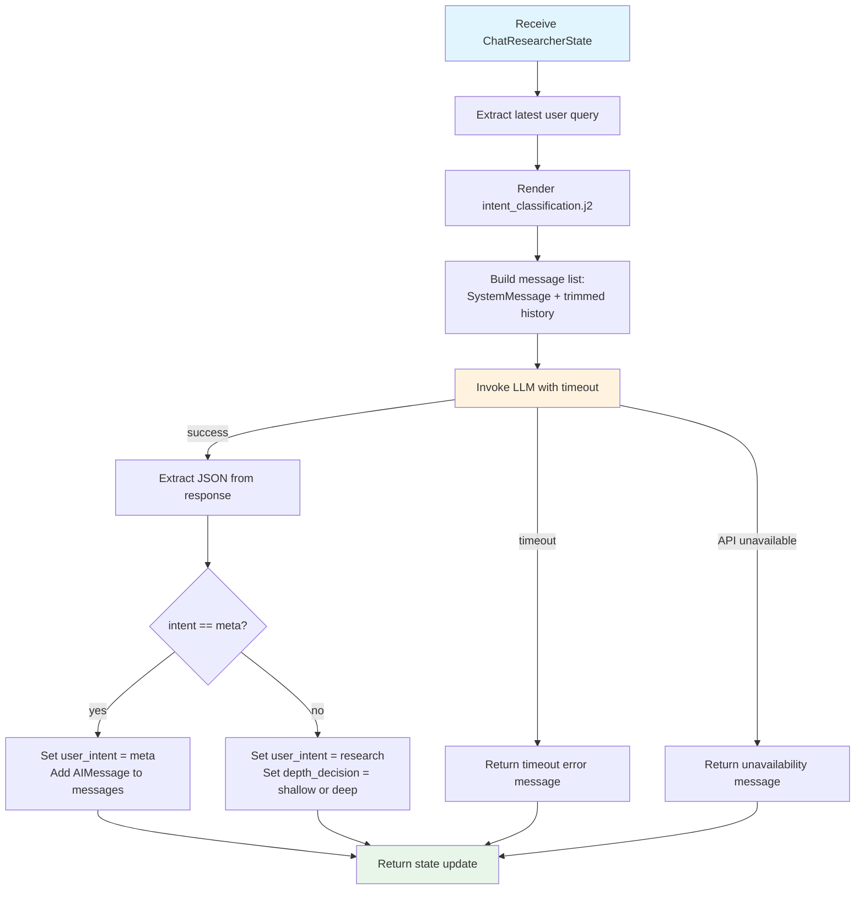

<!--
SPDX-FileCopyrightText: Copyright (c) 2025-2026, NVIDIA CORPORATION & AFFILIATES. All rights reserved.
SPDX-License-Identifier: Apache-2.0
-->

# Intent Classifier

The Intent Classifier is a single orchestration node that performs three roles
in one LLM call: intent classification, meta response generation, and depth
routing. It is the entry point for every query in the AI-Q workflow.

**Location:** `src/aiq_agent/agents/chat_researcher/nodes/intent_classifier.py`

## Purpose

Rather than using separate classifiers for intent and depth, the Intent
Classifier combines all routing decisions into a single LLM invocation. This
minimizes latency for the common case (meta queries get an instant response)
and avoids an extra round-trip for research queries.

The classifier outputs structured JSON with:

- **Intent** -- `meta` or `research`
- **Meta response** -- a direct reply when intent is `meta`
- **Depth decision** -- `shallow` or `deep` when intent is `research`

## Internal Flow



## State Model

The Intent Classifier reads from and writes to `ChatResearcherState`:

**Inputs read:**

| Field | Usage |
| ----- | ----- |
| `messages` | Conversation history; the last message is the current query |
| `user_info` | Optional user info injected into the prompt for personalization |
| `data_sources` | Used to build the tools info list shown to the LLM |

**Outputs written:**

| Field | Type | Condition |
| ----- | ---- | --------- |
| `user_intent` | `IntentResult(intent="meta" or "research")` | Always |
| `messages` | Appended `AIMessage` with meta response | When intent is `meta` |
| `depth_decision` | `DepthDecision(decision="shallow" or "deep")` | When intent is `research` |

### IntentResult

```{literalinclude} ../../../../src/aiq_agent/agents/chat_researcher/models/intent.py
:language: python
:pyobject: IntentResult
:caption: IntentResult model
```

### DepthDecision

```{literalinclude} ../../../../src/aiq_agent/agents/chat_researcher/models/depth.py
:language: python
:pyobject: DepthDecision
:caption: DepthDecision model
```

## Configuration

Configured through `IntentClassifierConfig` (NeMo Agent Toolkit type name: `intent_classifier`):

| Parameter | Type | Default | Description |
| --------- | ---- | ------- | ----------- |
| `llm` | `LLMRef` | required | LLM to use for classification |
| `tools` | `list[FunctionRef \| FunctionGroupRef]` | `[]` | Tool references; their names and descriptions are shown to the LLM so it can assess query complexity |
| `verbose` | `bool` | `false` | Enable verbose logging using `VerboseTraceCallback` |
| `llm_timeout` | `float` | `90` | Timeout in seconds for the LLM call |

**Example YAML:**

```yaml
functions:
  intent_classifier:
    _type: intent_classifier
    llm: nemotron_llm
    tools:
      - web_search_tool
    verbose: true
    llm_timeout: 90
```

## Prompt Template

The classifier uses `intent_classification.j2` located in
`src/aiq_agent/agents/chat_researcher/prompts/`.

Template variables:

| Variable | Source |
| -------- | ------ |
| `query` | Content of the last user message |
| `current_datetime` | Current date and time string |
| `user_info` | User info dict (name, email) or empty |
| `tools` | List of `{name, description}` dicts for available tools |

The prompt instructs the LLM to respond with a JSON object containing
`intent`, `meta_response` (when meta), and `research_depth` (when research).

## Error Handling

The classifier handles two failure modes gracefully:

- **LLM API unavailable** (404, model not found): Returns a user-friendly
  message asking to check the API key and model configuration.
- **Timeout** (asyncio timeout, 504 gateway): Returns a timeout message.
  The timeout is configurable through `llm_timeout` (default 90 seconds).

In both cases, the error message is returned as an `AIMessage` so the
orchestrator routes to `END` and the user sees the error.

## Example I/O

**Meta query:**

```
Input:  "Hello! What can you do?"
Output: user_intent = IntentResult(intent="meta")
        messages += [AIMessage("Hi! I'm a research assistant...")]
        -> routes to END
```

**Research query (shallow):**

```
Input:  "What is CUDA?"
Output: user_intent = IntentResult(intent="research")
        depth_decision = DepthDecision(decision="shallow")
        -> routes to shallow_research
```

**Research query (deep):**

```
Input:  "Compare the economic impacts of renewable energy adoption across G7 nations"
Output: user_intent = IntentResult(intent="research")
        depth_decision = DepthDecision(decision="deep")
        -> routes to clarifier
```
