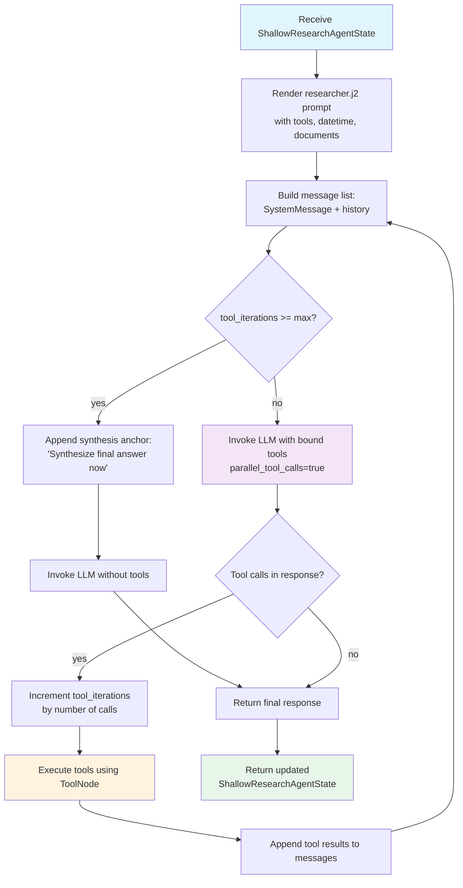
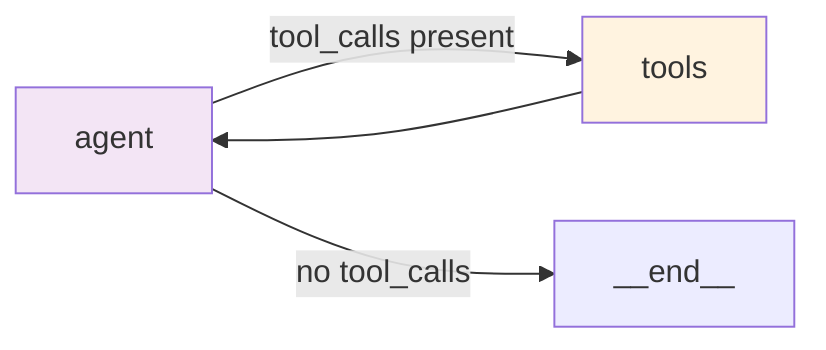

<!--
SPDX-FileCopyrightText: Copyright (c) 2025-2026, NVIDIA CORPORATION & AFFILIATES. All rights reserved.
SPDX-License-Identifier: Apache-2.0
-->

# Shallow Researcher Agent

The Shallow Researcher performs fast, bounded tool-augmented research. It
handles the majority of queries -- simple factual lookups, single-step
questions, and straightforward comparisons -- using a tight tool-calling loop
with configurable iteration limits.

**Location:** `src/aiq_agent/agents/shallow_researcher/agent.py`

## Purpose

The shallow path is optimized for speed and cost:

- A single LLM with bound tools handles the full research cycle
- Tool calls are counted against a budget (`max_tool_iterations`)
- When the budget is exhausted, a synthesis anchor forces the LLM to produce
  a final answer with citations instead of making more tool calls
- Context compaction keeps the message window manageable for long tool chains

## Internal Flow



### [LangGraph](https://docs.langchain.com/oss/python/langgraph/overview) Structure

The agent builds a two-node `StateGraph`:



- **`agent` node**: Renders the system prompt, invokes the LLM (with or
  without tools depending on iteration count), and tracks tool call budget.
- **`tools` node**: `langgraph.prebuilt.ToolNode` that executes tool calls
  and appends results to messages.
- **Routing**: `tools_condition` from LangGraph checks whether the LLM
  response contains tool calls.

The recursion limit is set to `(max_llm_turns * 2) + 10` to account for
the agent-tools round trips plus headroom.

## State Model

### ShallowResearchAgentState

| Field | Type | Default | Description |
| ----- | ---- | ------- | ----------- |
| `messages` | `Annotated[list[AnyMessage], add_messages]` | required | Conversation history with LangGraph message reducer |
| `data_sources` | `list[str]` or `None` | `None` | User-selected data source IDs for tool filtering |
| `user_info` | `dict` or `None` | `None` | User information for prompt personalization |
| `tools_info` | `list[dict]` or `None` | `None` | Override tools info (used when data_sources filters tools) |
| `available_documents` | `list[AvailableDocument]` or `None` | `None` | User-uploaded documents with summaries |
| `collection_name` | `str` or `None` | `None` | Knowledge collection name |
| `tool_iterations` | `int` | `0` | Counter tracking total tool calls made |

## Configuration

Configured through `ShallowResearchAgentConfig` (NeMo Agent Toolkit type name: `shallow_research_agent`):

| Parameter | Type | Default | Description |
| --------- | ---- | ------- | ----------- |
| `llm` | `LLMRef` | required | LLM to use for research |
| `tools` | `list[FunctionRef \| FunctionGroupRef]` | `[]` | Tools available for research (web search, document search, etc.) |
| `max_llm_turns` | `int` | `10` | Maximum LLM interaction turns |
| `max_tool_iterations` | `int` | `5` | Maximum tool calls before forcing synthesis |
| `verbose` | `bool` | `false` | Enable verbose logging |

**Example YAML:**

```yaml
functions:
  shallow_research_agent:
    _type: shallow_research_agent
    llm: nemotron_llm
    tools:
      - web_search_tool
    max_llm_turns: 10
    max_tool_iterations: 5
    verbose: true
```

## Prompt Template

The agent uses `researcher.j2` located in
`src/aiq_agent/agents/shallow_researcher/prompts/`.

Template variables:

| Variable | Source |
| -------- | ------ |
| `tools` | List of `{name, description}` dicts for available tools |
| `user_info` | User info dict or empty |
| `current_datetime` | Current date and time string |
| `available_documents` | List of user-uploaded document summaries |

### Query Rewriting

When web search tools are available, the prompt includes a query
rewriting section. Before calling any search tool, the agent rewrites the
user's question into a search-friendly query that adds implied context:

- **Time context**: adds the current year for "upcoming" or "next" questions
- **Topic expansion**: expands vague shorthand with the obvious topic or scope

This improves search result relevance by ensuring the search index receives
queries with the full context the user assumed but did not state.

### Synthesis Anchor

When `tool_iterations >= max_tool_iterations`, the agent appends a
`HumanMessage` synthesis anchor after the conversation history:

> "You have exhausted your research budget. Synthesize the final answer now
> using the citations [1], [2] and the '## References' format.
> Do not attempt any further tool calls."

This combats the "Lost in the Middle" problem by placing the instruction at
the end of the context window.

## Citation Verification

The shallow researcher applies the same citation verification and report
sanitization pipeline as the deep researcher. After the LLM produces a final
response, all citations are validated against the sources actually retrieved
during tool calls, and unsafe or unverifiable URLs are removed.

See [Deep Researcher -- Citation Verification](./deep-researcher.md#phase-5-citation-verification-post-processing)
for full details on the verification logic, URL matching strategies, and
audit trail.

## Related

- [Architecture Overview](../overview.md) -- full system flow
- [Deep Researcher](./deep-researcher.md) -- multi-phase research for complex topics
- [Prompts](../../customization/prompts.md) -- customize the researcher.j2 template
