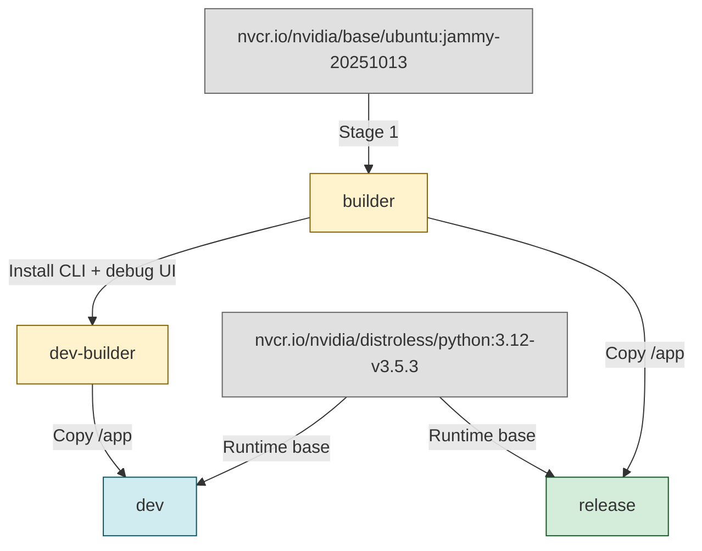

<!--
SPDX-FileCopyrightText: Copyright (c) 2025-2026, NVIDIA CORPORATION & AFFILIATES. All rights reserved.
SPDX-License-Identifier: Apache-2.0
-->

# Docker Build System

The AI-Q blueprint uses a multi-stage Dockerfile (`deploy/Dockerfile`) that produces two build targets: a development image with the CLI and a lean release image for production.

## Multi-Stage Architecture



The build consists of four stages:

| Stage | Base image | Purpose |
|-------|-----------|---------|
| `builder` | `nvcr.io/nvidia/base/ubuntu:jammy-20251013` | Installs Python 3.12, system dependencies, and all application packages. |
| `dev-builder` | `builder` | Extends builder with the CLI and debug UI packages. |
| `dev` | `nvcr.io/nvidia/distroless/python:3.12-v3.5.3` | Development runtime -- copies from `dev-builder`. |
| `release` | `nvcr.io/nvidia/distroless/python:3.12-v3.5.3` | Production runtime -- copies from `builder` (no CLI). |

## Builder Stage

The builder stage handles all compilation and package installation:

1. **System dependencies** -- Installs build tools, curl, git, and Python 3.12 from the `deadsnakes` PPA.
2. **Virtual environment** -- Creates a venv at `/app/.venv` using `uv`.
3. **Dependency installation** -- Runs `uv sync --frozen --no-dev --no-install-workspace` to install locked dependencies.
4. **Workspace packages** -- Installs application packages with `uv pip install -e` (the root package uses `--no-deps`):
   - Root workspace package (`aiq-agent`) using `uv pip install --no-deps -e .`
   - `sources/google_scholar_paper_search` -- Google Scholar search
   - `sources/tavily_web_search` -- Tavily web search
   - `sources/knowledge_layer[all]` -- Knowledge layer with all extras
   - `frontends/aiq_api` -- [FastAPI](https://fastapi.tiangolo.com/) frontend
   - `psycopg[binary]>=3.0.0` -- PostgreSQL driver (psycopg v3, installed non-editable)
5. **File setup** -- Makes startup scripts executable, creates `/app/data`, and sets ownership to UID 1000.

Only runtime scripts (`deploy/entrypoint.py` and `deploy/start_web.py`) are copied from the `deploy/` directory. The full `deploy/` directory is excluded to avoid leaking `.env` files, Helm charts, compose files, or other development artifacts into the image.

## Dev Stage

The development image extends the builder with additional packages:

- `frontends/cli` -- Command-line interface (`nat` CLI commands)
- `frontends/debug` -- Debug UI for local development

### Build

```bash
docker build --target dev -t aiq:dev -f deploy/Dockerfile .
```

### What Is Included

- All application packages plus CLI and debug UI.
- Python 3.12 runtime from the NVIDIA distroless base image.
- Startup scripts (`entrypoint.py`, `start_web.py`).
- Runs as non-root user (UID 1000).

## Release Stage

The release image is built from the base `builder` stage (no CLI or debug packages):

### Build

```bash
docker build --target release -t aiq:prod -f deploy/Dockerfile .
```

### What Is Included

- Application packages only (no CLI, no debug UI).
- `APP_ENV=production` set by default.
- Same non-root user and distroless base as the dev image.

## Build Commands Summary

| Target | Command | Use case |
|--------|---------|----------|
| `dev` | `docker build --target dev -t aiq:dev -f deploy/Dockerfile .` | Local development, testing, CLI access |
| `release` | `docker build --target release -t aiq:prod -f deploy/Dockerfile .` | Production deployment, CI/CD |

When using Docker Compose, the build target is controlled by the `BUILD_TARGET` variable:

```bash
# Dev build (default)
cd deploy/compose
docker compose --env-file ../.env -f docker-compose.yaml up -d --build

# Release build
BUILD_TARGET=release docker compose --env-file ../.env -f docker-compose.yaml up -d --build
```

## Base Images

| Image | Used in | Purpose |
|-------|---------|---------|
| `nvcr.io/nvidia/base/ubuntu:jammy-20251013` | Builder stages | Full Ubuntu with package managers for compilation. |
| `nvcr.io/nvidia/distroless/python:3.12-v3.5.3` | Runtime stages (`dev`, `release`) | Minimal NVIDIA distroless image with Python 3.12. No shell, no package manager -- reduces attack surface. |

## Startup Scripts

The container entrypoint is `python /app/deploy/entrypoint.py`, which orchestrates the full startup sequence. There are two scripts involved:

### entrypoint.py -- [Dask](https://www.dask.org/) cluster launcher

`entrypoint.py` is the Docker `ENTRYPOINT`. It performs the following:

1. **Argument pass-through** -- If command-line arguments are provided, it `exec`s them directly (useful for running one-off commands in the container).
2. **Dask scheduler** -- Starts a `dask-scheduler` process on the configured port (default `8786`) with a dashboard on port `8787`.
3. **Wait for scheduler** -- Polls the scheduler with a Dask `Client` for up to 30 attempts (1 second apart).
4. **Dask worker** -- Starts a `dask-worker` process connected to the scheduler.
5. **Environment variable** -- Sets `NAT_DASK_SCHEDULER_ADDRESS` so the web server can submit background jobs.
6. **Web server** -- Launches `start_web.py` as a subprocess.
7. **Signal handling** -- Installs SIGTERM/SIGINT handlers that gracefully shut down all three processes (web, worker, scheduler).

**Environment variables:**

| Variable | Default | Description |
|----------|---------|-------------|
| `CONFIG_FILE` | `/app/configs/config_web_default_llamaindex.yml` | Path to the NeMo Agent Toolkit workflow config. |
| `HOST` | `0.0.0.0` | Bind address for the web server. |
| `PORT` | `8000` | Bind port for the web server. |
| `DASK_SCHEDULER_PORT` | `8786` | Dask scheduler port. |
| `DASK_NWORKERS` | `1` | Number of Dask workers. |
| `DASK_NTHREADS` | `4` | Threads per Dask worker. |

### start_web.py -- FastAPI server (direct uvicorn)

`start_web.py` bypasses the standard `nat serve` command to avoid an asyncio event loop conflict between the NeMo Agent Toolkit runtime and FastAPI/Starlette's anyio event loop management.

It performs the following:

1. **Configure logging** -- Sets up structured logging matching `nat serve` behavior.
2. **Load config** -- Validates the NeMo Agent Toolkit YAML config using `nat.runtime.loader.load_config()`.
3. **Set environment** -- Writes `NAT_CONFIG_FILE` and `NAT_FRONT_END_WORKER` so NeMo Agent Toolkit's FastAPI app can find the config and worker class.
4. **Run uvicorn** -- Starts uvicorn directly with `loop="asyncio"`, letting uvicorn create and manage its own event loop.

**Environment variables:**

| Variable | Default | Description |
|----------|---------|-------------|
| `CONFIG_FILE` | `/app/configs/config_web_frag.yml` | Path to the NeMo Agent Toolkit workflow config. |
| `HOST` | `0.0.0.0` | Bind address. |
| `PORT` | `8000` | Bind port. |
| `LOG_LEVEL` | `INFO` | Logging verbosity. |
